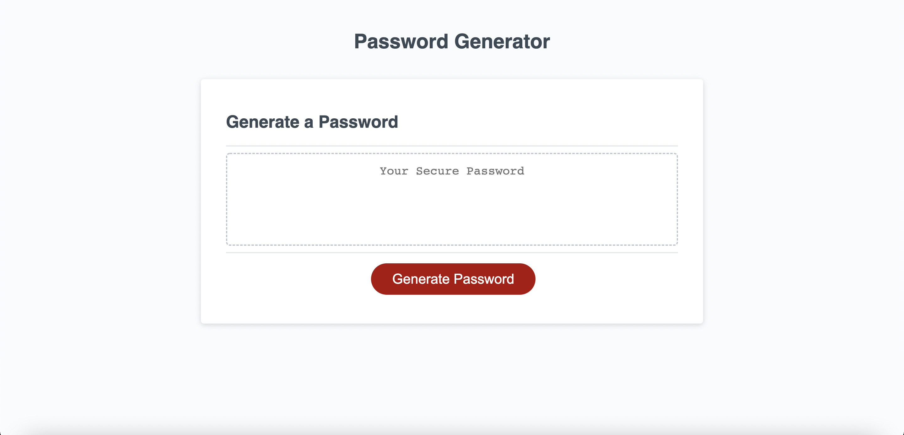
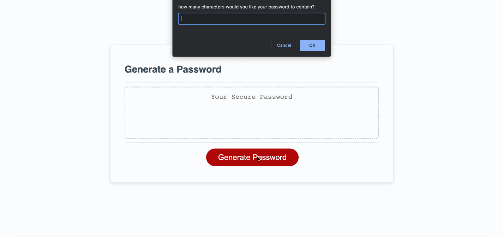

# Random Password Generator

## Description

Random password generator for all your secure password needs. This page will randomly generate a password based on the criteria you select!  

## Visuals

## Usage 

Simply click the button labelled "Generate Password". You will be asked to enter how many characters you would like your password to be. It must be between 8 and 120, or you will receive a pop up message. You will then be prompted to set the character types (lowecase, uppercase, numerical, special) that you would like your password to contain. You must select at least one character type or will receive a pop up messages. Once you set the amount and type of characters, a random password will automatically be generated for you!

## Links

1. https://github.com/mateonav98/random-password-generation
2. https://mateonav98.github.io/random-password-generation/

## Code

1. HTML
2. CSS
3. JavaScript

## Author

Mateo Navarro

LinkedIn: https://www.linkedin.com/in/mateonav

GitHub: https://github.com/mateonav98